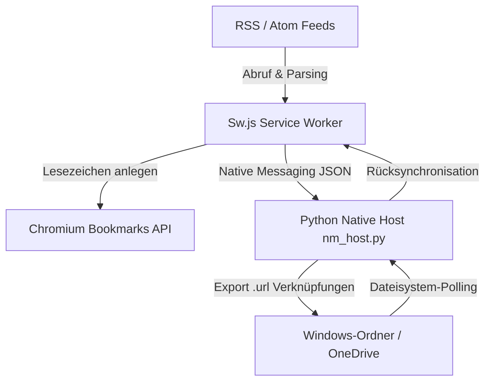

# RSS-BOOKSTORE

[English](README.md) | [Deutsch](README_de.md)

[](https://github.com/file-bricks/RSS-BOOKSTORE/actions/workflows/tests.yml)
[](LICENSE)
[]()
[]()

> **Power-User Chromium-Erweiterung** — Speichert RSS/Atom-Feeds als Browser-Lesezeichen und synchronisiert sie über einen Native Messaging Host bidirektional als `.url`-Dateien mit einem lokalen Windows-Ordner.

> [!IMPORTANT]
> **Alpha-Status — Entwicklungs- & Sideloading-Version**
> Dies ist eine Alpha-Version. Kernfunktionen sind vollständig implementiert und durch automatisierte Tests abgedeckt. Die Erweiterung ist für Sideloading/Entwicklerinstallation gedacht. Für eine einfache, im Chrome Web Store verfügbare Variante ohne Native Messaging siehe [RSS-BOOK](https://github.com/file-bricks/RSS-BOOK).

---

## Übersicht & Funktionsweise

RSS-BOOKSTORE verbindet klassische RSS/Atom-Feedreader mit dem lokalen Windows-Dateisystem. Feed-Einträge werden automatisch als strukturierte Browser-Lesezeichen angelegt und über einen Python-basierten Native Messaging Host im Hintergrund als `.url`-Internet-Verknüpfungen in Windows-Ordnern (z. B. auf OneDrive) gespiegelt.



## Hauptmerkmale

- **RSS 2.0 & Atom Support**: Automatische Feed-Updates mit ETag/Conditional GET Caching.
- **Lesezeichen-Export**: Speichert Feed-Beiträge direkt in Chromium-Lesezeichenordnern.
- **Windows-Ordner-Sync**: Spiegelt Feed-Einträge als native `.url`-Dateien im Windows-Explorer.
- **Bidirektionale Synchronisation**: Änderungen in Lesezeichen oder im Zielordner werden wechselseitig abgeglichen.
- **OneDrive-Integration**: Erkennt automatisch den Windows OneDrive-Standardpfad (`OneDrive\RSS-BOOKSTORE`).
- **Minimales Rechtekonzept**: Fordert Host-Berechtigungen nur zielgerichtet pro Feed-Domain an (`optional_permissions`).
- **PowerShell Native Host Installer**: Einfache Registrierung für Chrome, Edge und Brave.
- **Modernes UI**: Dark-first Popup & Optionen-Oberfläche mit Accessibility-Unterstützung und Barrierefreiheit.

## Systemanforderungen

- **Betriebssystem**: Windows 10 / 11
- **Python**: Python 3 auf dem Systempfad (`PATH`) verfügbar
- **Browser**: Chromium-basierte Browser (Chrome, Edge, Brave, Vivaldi) mit Entwicklermodus für entpackte Erweiterungen
- **PowerShell**: Für die Registrierung des Native Messaging Hosts

---

## Installation & Einrichtung

### 1. Erweiterung im Browser laden

1. Repository herunterladen oder geklontes Verzeichnis bereitstellen.
2. Im Browser `chrome://extensions`, `edge://extensions` oder `brave://extensions` öffnen.
3. Den **Entwicklermodus** (oben rechts) aktivieren.
4. Auf **Entpackte Erweiterung laden** klicken und den Ordner `RSS-BOOKSTORE` auswählen.
5. Die generierte **Erweiterungs-ID** (32 Kleinbuchstaben) aus der Browser-Detailansicht kopieren.

### 2. Native Messaging Host registrieren

Öffne PowerShell im Projektordner und führe das Installationsskript mit deiner Erweiterungs-ID aus:

```powershell
powershell -NoProfile -ExecutionPolicy Bypass -File .\native_host\install_nm_host.ps1 -ExtensionId aaaaaaaaaaaaaaaaaaaaaaaaaaaaaaaa
```

Der Installer legt die Konfiguration `native_host\nm_manifest.generated.json` an und registriert den Host `com.file_bricks.rss_bookstore` in der Windows-Registrierung (`HKCU`).

#### Optionale Parameter des Installers:

- **Dry-Run (Vorschau ohne Schreiben)**:
  ```powershell
  powershell -NoProfile -ExecutionPolicy Bypass -File .\native_host\install_nm_host.ps1 -ExtensionId aaaaaaaaaaaaaaaaaaaaaaaaaaaaaaaa -DryRun
  ```
- **Spezifischer Browser (z. B. nur Edge)**:
  ```powershell
  powershell -NoProfile -ExecutionPolicy Bypass -File .\native_host\install_nm_host.ps1 -ExtensionId aaaaaaaaaaaaaaaaaaaaaaaaaaaaaaaa -Browser Edge
  ```
- **Deinstallation**:
  ```powershell
  powershell -NoProfile -ExecutionPolicy Bypass -File .\native_host\install_nm_host.ps1 -ExtensionId aaaaaaaaaaaaaaaaaaaaaaaaaaaaaaaa -Uninstall
  ```

---

## Synchronisationsmodi

In den Optionen der Erweiterung kann der gewünschte Betriebsmodus pro Feed oder global gewählt werden:

| Modus | Lesezeichen | Ordner-Export | Beschreibung |
|---|:---:|:---:|---|
| `BOOKMARKS` | Ja | Nein | Reiner Lesezeichen-Modus (Feeds → Browser-Lesezeichen) |
| `FOLDER` | Nein | Ja | Reiner Ordner-Export (Feeds → `.url`-Dateien im Windows-Ordner) |
| `SYNC` | Ja | Ja | Vollständig bidirektionale Synchronisation zwischen Lesezeichen und Ordner |

---

## Abgrenzung & Geschwisterprojekt

| Merkmal | [RSS-BOOK](https://github.com/file-bricks/RSS-BOOK) | **RSS-BOOKSTORE** (dieses Repo) |
|---|---|---|
| **Zielgruppe** | Anwender im Chrome Web Store | Power-User & Entwickler (Sideloading) |
| **Native Messaging** | Nein | Ja (Python-Host unter Windows) |
| **Sync-Richtung** | Einweg (Feed → Lesezeichen) | Bidirektional (Lesezeichen ↔ Ordner) |
| **Datei-Export** | Nein | Ja (`.url`-Dateien in Windows-Ordner) |
| **Installation** | Ein-Klick (Web Store) | Entpackt laden + PowerShell-Setup |

---

## Entwicklung & Tests

Das Projekt kommt ohne komplexe Build-Schritte aus. Die JavaScript- und Python-Tests können wie folgt ausgeführt werden:

```powershell
# JavaScript Tests ausführen
npm.cmd test

# Python Native Messaging Host Tests ausführen
python -B -m unittest discover -s tests -p "test_*.py" -v
```

---

## Lizenz & Legal

Lizenziert unter der **MIT-Lizenz**. Siehe [LICENSE](LICENSE) für Details.
